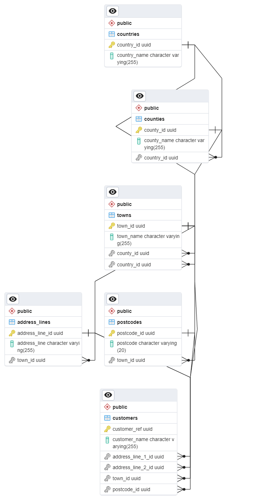

# Customer CSV reader app

## Tech stack
- Java 17
- Apache Commons
- Spring Boot 3
- Lombok
- Maven
- PostgreSQL
- Hibernate
- Docker
- JUnit 5
- Wiremock

## Prerequisites

- JDK 17 (or later)
- Maven 
- Docker
# Usage

## Running the console app

I have deployed everything into the docker container for the simplicity of installation.
You need to run these four commands:

```
docker-compose build
```
```
docker-compose up
```
```
docker-compose stop console-app 
```
```
docker-compose run console-app
```
When it prompts you to enter the file, you can enter correct.csv which is already in the image.
There are other csv files used in the tests for different test cases.

# REST API

The service exposes two endpoints.

## 1) Get Customer by reference
Retrieves customer details by their customer reference (id)

### Endpoint

``` GET api/customers/{customerRef}```

### Parameters
`customerRef` (UUID) - Customer's ID

## 2) Add a batch of customers
Saves a batch of customers to the PostgreSQL database

### Endpoint

``` POST api/customers```

### Request Body
   ```json
   [
  {
    "customerRef": "a18acba4-8fb6-11ee-b9d1-0242ac120002",
    "customerName": "Yulia",
    "addressLine1": "Some address",
    "addressLine2": "",
    "town": "Putney",
    "county": "London",
    "country": "UK",
    "postcode": "sw7 8sp"
  }
]
  
  ```


# DB design

I used a PostgreSQL database. I split the data into multiple tables for data integrity, normalisation, scalability, and flexibility. I have also added some indexes for performance optimisation.


# Comments

I have intentionally simplified some design like url hard-coding for simpler Docker deployment. In a real application, I would have taken them from the configuration in the cloud.

Generally, I have followed the SOLID princples across my application. In particular, I programmed against interfaces wherever possible in order to allow flexibility and better maintainability, e.g. it would be easier to replace implementation or introduce new file parsers in the future. I have also used an Apache library for parsing CSV files, as this way it is more precise and safe.

I have also implemented a POST endpoint as a batch straight away in case some files would have multiple entries so that it can parse a batch straight away.

I have covered my application with unit and integration tests. You will need the REST-API module with the database to be running in order to run these tests.